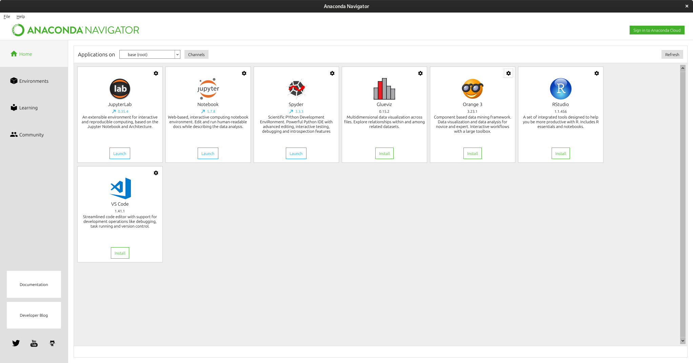
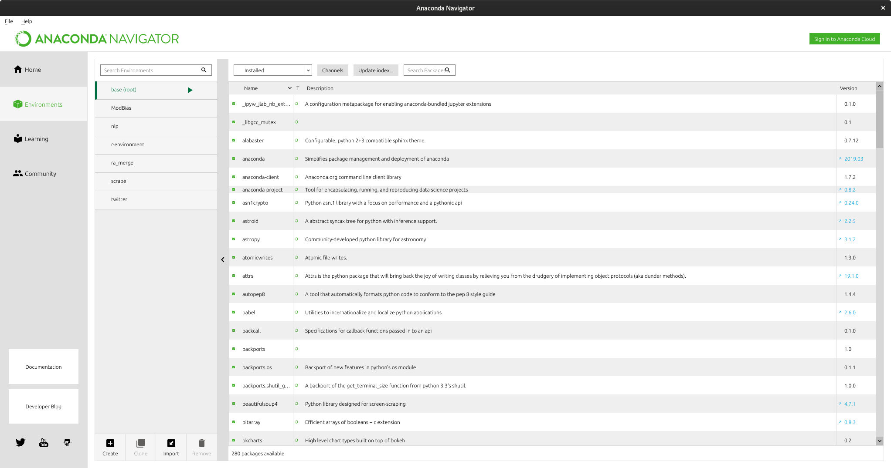
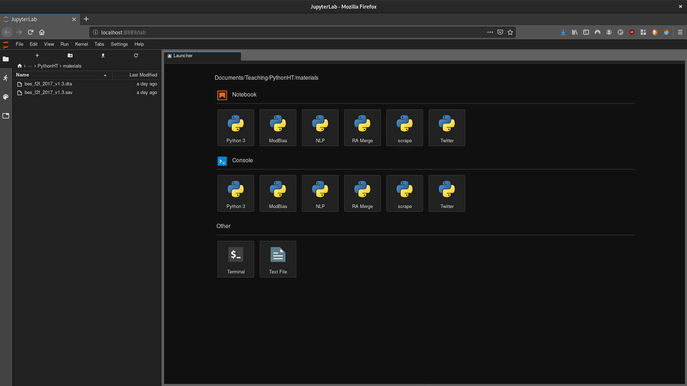
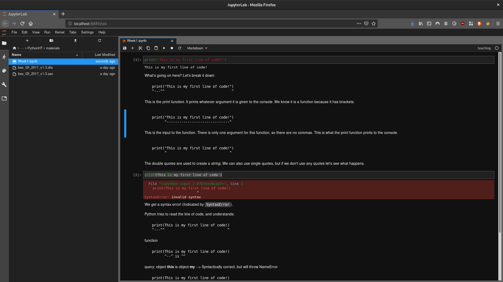
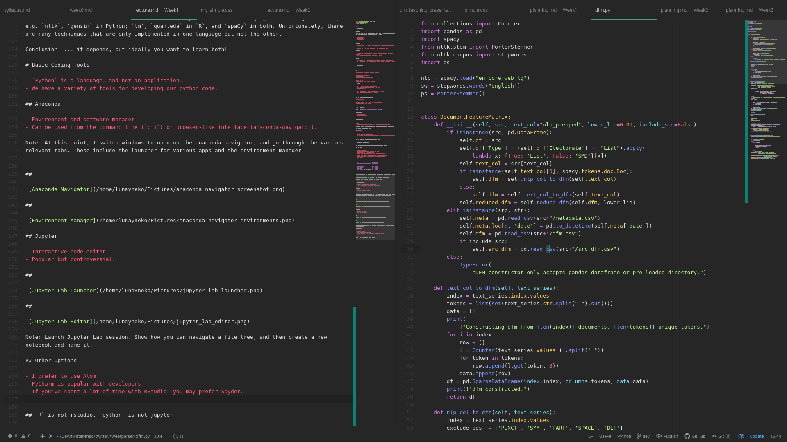

# Course Overview

<aside class="notes">
Next few slides are primarily details about the course.
</aside>

## Schedule

8-week long course will take place on Wednesdays at the IT Lab in the Manor Road Building. Each week will consist of a three-hour session divided roughly as follows:

- 1615-1715: Lecture
- 1715-1725: Break
- 1725-1825: Workshop
- 1825-1925: Clinic

<aside class="notes">
Mention that class in 3rd week (5th Feb) will be moved to Monday (3rd Feb).
</aside>

## Lecture

- During the lectures I will discuss a mixture of theory and methods. The slides will be made available at the following:
  - https://github.com/muhark/dpir-intro-python
  - Canvas?
- Please feel free to stop me and ask questions! I have alloted time for this.

<aside class="notes">
Slides are generated with `reveal.js`. Should be viewable on any device with a browser.
</aside>

## Workshop

- In the workshop, you will work through a number of set programming problems and discussion questions.
- Answers will be discussed as a class for the final 10 minutes.

## Clinic

- Each week, there will be tasks and projects for you to try in your own time, if you wish.
- I'll be available for an hour after each session to answer questions one-to-one or in small groups.

# Course Structure

<aside class="notes">
Mention here that the lectures will generally take the format of:
1. methodology and model (theory)
2. implementation (operationalisation)
3. relevance to research (examples)
4. coding tutorial
</aside>

## Topics:

1. Introduction to Python and the Development Environment
2. Data Structures and `pandas` I
3. Data Structures and `pandas` II
4. Data Visualisation
5. Machine Learning with `scikit-learn` I
6. Machine Learning with `scikit-learn` II
7. Mining the Web
8. Introduction to Natural Language Processing

## Feedback

- This is my first try at this course, and I'm looking for continuous feedback.
- Feedback can either be:
    -  sent to me at `musashi.harukawa@politics.ox.ac.uk`
    -  or communicated via a Google survey (to be sent each week).

<aside class="notes">
- This is a brand new course, and far from perfect.
- I would appreciate and welcome any feedback on any aspect.
- Please also feel free to come talk to me in person!
</aside>

# Week 1: Introduction to Python and the Development Environment

## Overview:

This week will cover the following points:

1. What is Python?...
2. ... and what can I use it for?
3. What are the tools I have to write, test and run Python code?
4. Coding tutorial I: Base Data Types and Structures

# What is Python?...

## Python is an _open-source, general-purpose scripting language_.

## Open-Source

- Built by a community
- Maintained by a community
- Free to use for all

## General-Purpose

- If you're doing it on a computer and there's some repetitive element, then you can automate it in Python.
- Python isn't limited to Data Science, but it's very popular with data scientists!

<aside class="notes">
Large community means that a larger number of people create, contribute to, and maintain the data analysis tools that we all use.
</aside>

## Scripting

- No strict definition for what a "script" is.
- Series of commands to automate some task.
- Like a pipeline: takes some inputs, does some things to these inputs, and gives back some outputs.

<aside class="notes">
It's good to keep the input-output framework in your head.
</aside>

# and what can I use Python for?

## I want to...

Some reasons you, as a social science researcher, may want to learn Python:

- Clean up my messy data!
- Run analyses with (hundreds of) millions of data points
    - it won't fit into an excel spreadsheet!
- I want to automate downloading several decades of newspaper articles!
- I want to create beautiful (interactive) visuals to accompany my analyses!
- I want to uncover hidden structures linking parliamentary committees!
- ... and more!

## Comparison: Python vs `R`

| Task                               | `python` | `R`   |
| ---------------------------------- | -------- | ----- |
| General Purpose Programming        | Yes      | No    |
| Regression Analysis                | Kinda    | Yes   |
| Machine Learning                   | Yes      | Yes   |
| Web Scraping                       | Yes      | Kinda |
| Natural Language Processing[^1594] | Yes      | Yes   |
| Data Visualisation                 | Yes      | Yes   |

[^1594]: Python and `R` both provide extensive and powerful natural language processing libraries, e.g. `nltk`, `gensim` in Python; `tm`, `quanteda` in `R`, and `spaCy` in both. Unfortunately, there are many techniques that are only implemented in one language but not the other.

Conclusion: ... it depends, but ideally you want to learn both!

# Basic Coding Tools

## Language $\ne$ Editor

- `Python` is a language, and not an application.
- We have a variety of tools for developing our python code.

## Anaconda

- Environment and software manager.
- Can be used from the command line (`cli`) or browser-like interface (anaconda-navigator).

<aside class="notes">
At this point, I switch windows to open up the anaconda navigator, and go through the various relevant tabs. These include the launcher for various apps and the environment manager.
</aside>

##

<aside class="notes">
- Make sure students can find navigator, and open applications from it.
</aside>

##

<aside class="notes">
- Show students how to install packages here. Also mention that this can be done from the command line.
</aside>

## Jupyter

- Interactive code editor.
- Popular, but has its detractors.

<aside class="notes">
- I don't use it, but I started off with it. I recommend that you give it a go.
</aside>

##

##

<aside class="notes">
Launch Jupyter Lab session. Show how you can navigate a file tree, and then create a new notebook and name it.
</aside>

## Other Options

- I prefer to use Atom with Hydrogen
- PyCharm is popular with developers
- If you've spent a lot of time with RStudio, you may prefer Spyder.

##

## Basic Workflow

1. Open up Anaconda Navigator
2. Open up Jupyter Lab (or Notebook)
3. Navigate to relevant directory
4. Open pre-existing notebook, or create new one.
5. Start coding!

# Motivation

##

- Today we learn about two fundamental, but abstract aspects of coding:
  - Data Types
  - Data Structures

<aside class="notes">
I want to spend a brief moment to explain why this is relevant.
</aside>

## Why Automate?

- In general, as social scientists using computational methods, our goal is to automate some component of our analysis.
- The advantage of automation is cost, scale, and scope.
- But in order to harness these methods, we need to structure our information in a way that algorithms and programs can utilise.
    - This process of quantifying and structuring our observations usually entails the loss of some information.

<aside class="notes">
- Some qualitative scholars I speak to contend that the validity of the quantitative endeavour ends there.
    - Are there unquantifiable things?
- I'm more optimistic about what is possible, and think that the key to having valid quantitative inferences is to be extremely clear on the connection between the data in your analysis and the actual events you are measuring.
</aside>

## Bridging the Gap between Qualitative and Quantitative Methods

- Choosing a representation of your information that retains relevant properties is key.
- To read more about this particular debate, a good starting point is [Stevens (1946)](https://pdfs.semanticscholar.org/2680/6102a45a6104489872dd3241b6e8030bbc40.pdf).

<aside class="notes">
- I would love to discuss this further, but this isn't really that kind of methods class.
</aside>

## Data Types

Some (statistical) data types:

- Numerical
    - Interval
    - Ratio
    - Count
- Text
- Date and time
- Logical
- Categorical

<aside class="notes">
(_Before points_) 
- What do I mean when I talk about different "types" of data?
- Small exercise: what are instances of each of these?
</aside>

## Representing Data on a Computer

- _Good news:_
    - Python, like most modern programming languages, has ways to represent each of the data types listed above.
- _Bad news:_
    - At a fundamental level, this is being stored as 0's and 1's.
- _Take away:_
    - Take the time to understand the relationship between:
        -  your empirical observations,
        -  the abstracted representation of them in your mathematical model,
        -  the approximation of this in your computational model.

<aside class="notes">
- I'm making a bit of an assumption here about the theory-generating workflow, in that a stylised mathematical model is usually prior to a computational/empirical approach.
</aside>

## Data Structures

- Data types are concerned with the representation of individual data points, or observations.
- Data structures are concerned with the relations between observations.
    - Are the data points members of the same set?
    - Are the data points members of the same sequence?
    - Are the data points different features of single empirical unit?

## Exercise

<aside class="notes">
- Question to discuss with partner: how would you represent this information in a computer? Possible answers include:
    - Data Frame (a combination of relational and vector data)
    - Multiple sequences
    - Hierarchically: course -> item -> - desc. - price
</aside>

## And now...

### Let's get to coding!

# Coding Recap

## Variable Assignment

Variables can be assigned with `=`.

## Four Basic Data Types

There are four basic data types in Python. These are:

- String
- Integer
- Float
- Boolean

## String

- _A sequence of characters_.
- Behaves like a sequence; can be indexed with `[index]`

## Integer

- Whole numbers.
- Can be positive or negative.

## Float

- Decimal numbers.
- Behave unexpectedly. Remember: `0.1*3==0.3` returns `False`.

## Boolean

- True/False
- Behaves similarly to integers 0 and 1.

## Two basic data structures

We learned about two basic data structures:

- Lists
- Dictionaries

## Lists

- Lists are an ordered sequence of values.
- Created by writing a sequence of comma-separated values between square brackets:
  - i.e. `[1, 2, 5, "some string"]`
- Lists are mutable; values can be changed in place without creating a new variable.
- Lists can be indexed the same way as strings:
  - `[n]` to get the n+1th element.
  - `[m:n]` to get all elements from m+1 to n.

## Dictionaries

- Unordered mapping of _keys_ to _values_.
  - Cannot be indexed numerically, and if iterated over, will not return values in the same order.
- Created by writing a list of `key:value` pairs separated by commas between curly braces.
  - i.e. `{"cat": "meow", "dog": "bork"}`
- `some_dict[some_key]` returns the corresponding value for `some_key` in `some_dict`
- To see all of the keys, use the `.keys()` method of the dict, i.e. `some_dict.keys()`
- To see all of the values, use the `.values()` method of the dict, i.e. `some_dict.values()`

# Next Week: Data Structures and `pandas` I

We learn about:

- `pandas`, a key library for working with data
- Reading different data formats
- Slicing and indexing data

# Readings

##

The following sections of [_Python for Data Analysis: Data Wrangling with Pandas, NumPy and IPython, 2nd edition_](http://solo.bodleian.ox.ac.uk/permalink/f/89vilt/oxfaleph021507068) are relevant to this lecture:

_Useful_:
- 2.2: IPython Basics
- 3.1: Data Structures and Sequences

_Interesting_:
- 1.2 Why Python for Data Analysis?
