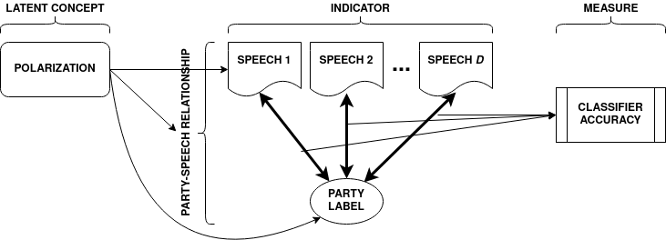
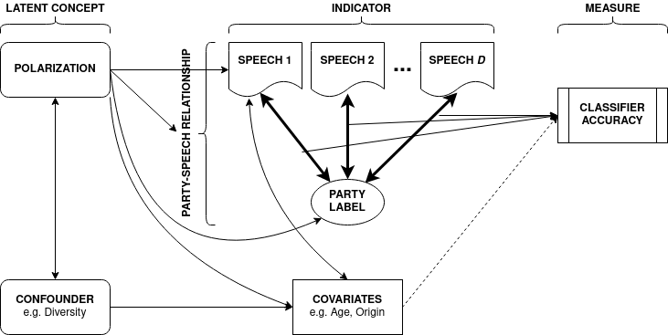
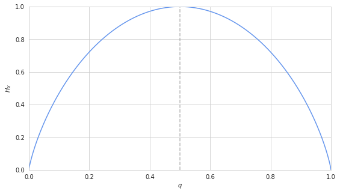

<!--  pandoc -t revealjs --slide-level 2 -V revealjs-url=../reveal.js -V theme=../../../dpir-intro-theme --mathjax -s -o presentation.html presentation.md -->

# Introduction

## Two Themes

Two broad themes in my research:

- **Methodological**: Measurement Inference in Complex Data Structures
- **Substantive**: Micro-targeted Political Campaigning

## Three Papers

1. _Marginal Information Gain: An Information Theoretic Response to Classifier Accuracy as a Quantity of Substantive Interest_
2. _This Ad was Tailored for You: Quantifying the Micro-targeting Effect and Inducing Informed Skepticism_
3. _Micro-targetable Information: the Data that Helps Campaigns the Most_

## Questions Before I Start

- _What can I expect?_
    - As I have no empirical results yet, this presentation will be mostly about design and methodology.
- _What feedback is useful?_
    - Paper 1: Does this paper seem relevant and clear?
    - Paper 2: Experimental design, normative arguments.
    - Paper 3: Clarity, normative arguments.
- _Why this order?_
    - The third paper relies on the data from the second, and a methodological result from the first.

# Paper 1

## Marginal Information Gain- An Information Theoretic Response to Classifier Accuracy as a Quantity of Substantive Interest

Breaking this down:

- Classifier Accuracy as a Measure of Polarization
- Information Theory and Mutual Information

## Context

- This paper began as a response to what I see as the shortcomings of a method first presented in [Peterson & Spirling (2018)](https://doi.org/10.1017/pan.2017.39), "Classification Accuracy as a Substantive Quantity of Interest: Measuring Polarization in Westminster Systems".
- The paper presents a novel method for measuring polarization in parliaments.
- Their method uses the classifier accuracy of a supervised machine learning model trained on the bag-of-words representation of parliamentary speech as a measure of polarization.

_Much of the motivation for my method can be understood by exploring this paper, so I'll spend a few slides on explaining their paper in detail._

## Peterson and Spirling (2018) Explained: Data

**Corpus:** 3.5 million UK parliamentary debate transcripts over 78 years from Hansard Archive

- Represented as **bag-of-words**, a count matrix indicating frequency of all unique terms across all documents. Called a document-token matrix (**DTM**).
- Rows are the set of all speeches (documents) across all sessions, also known as the corpus, $K$.
- Columns are the set of all unique terms (vocabulary, $V$).
- I denote this as matrix $\mathbf{X}$ with given element $x_{w \in V,\,d \in K}$ indicating the frequency of token $w$ in document $d$.

## Peterson and Spirling (2018) Explained: Model

Train supervised machine learning algorithm to predict **party label of speaker** from **word frequencies in speech**.

$$
    Y_{d} = f(\mathbf{X}_{d}) + \epsilon
$$

where:

- $Y_{d}$ is the party label of the speaker of speech $d$, and $X_{d}$ is the length-$V$ vector of word counts for speech $d \in K$.
- $f(\cdot)$ is a mapping from the $V$-dimensional feature space to the binary party label space.
- $\epsilon$ is an error term.

## Peterson and Spirling (2018) Explained: Algorithm

Note that I did not specify a functional form for $f(\cdot)$. This is because authors use four different algorithms:

- _perceptron+SGD_
- _SGD+batch sampler_
- _passive-aggressive classifier with hinge-loss_
- _logistic regression with L2 penalty_

The model is trained on a stratified 10-fold cross-validation training-test split.

## Peterson and Spirling (2018) Explained: Accuracy

Given a speech (i.e. vector of word counts), the fitted model gives a predicted party label of the speaker:

$$
    \hat{Y}_d = \hat{f}(\mathbf{X}_d)
$$

Associated with this prediction is an error, defined as:

$$
    \hat{\epsilon}_d \equiv |Y_d - \hat{Y}_d|
$$

In the binary case, we can describe the classifier accuracy as:

$$
    p(\epsilon) \equiv P[\hat{\epsilon_d}>0] = P[\hat{Y}_d \ne Y_d]
$$

## Peterson and Spirling (2018) Explained: Output and Intuition

- The fitted model will not always be able to infer the party label of the speaker from what they have said.
- The classifier accuracy over time is a summary of the ability of the model to infer party label based on speech.
- The intuition is that _in highly polarised parliaments, it is easier to guess the party identity of a speaker based on what they say_.
- Therefore, the accuracy of the classifier is a measure of the level of polarization.

## Peterson and Spirling (2018) Explained: Innovations and Relevance

- A common response to new measures is "ok great, now we have yet another way to measure this thing we already had fifteen measures for".
- I argue that the focus on _speech_ reveals an aspect of polarization that is not captured by looking at other indicators such as voting record.
- However, rather than a new measure of polarization, I think their use of classifier accuracy as a measure of substantive interest is more interesting and important.
- Supervised methods for latent concept measurement are extremely useful in a context where we have enormous quantities of complex trace data.

## Critiques of Peterson and Spirling (2018)

- If you think that the link between _the ease of predicting the party of a speaker_ and _polarization_ is problematic at best, I wholeheartedly agree with you.
- I think it is more helpful, however, to focus on the potential methodological contribution of their approach; substantive interpretations of meta-parameters of supervised models.
- Therefore my criticism of their work, and my proposed solution, is made with the aim of improving the method in order to achieve the goal of building valid measures from complex data in social sciences.

## Brief Aside on Measurement Theory

- To make clear my criticism of Peterson and Spirling's (2018) approach, I draw on some ideas from _Measurement Theory_.
- Measurement theory is an area of social science methodology concerned with the construction of _measures_.
- In the interest of time I will keep my discussion of this brief, but it's a fascinating field of social science methodology. Ben Lauderdale provides [an excellent introduction](https://uclspp.github.io/POLS0013/index.html) to the subject.

## Concepts, Indicators and Measures

Distinction between _concepts_, _indicators_ and _measures_.

- **Concepts** are (often latent) theoretical constructs. _Will not provide an ontology of concepts here but Goertz is a good resource_.
- **Indicators** are empirical phenomena, and therefore realizable, regular and measurable.
- **Measures** are constructs that systematize our observations of indicators, and make specific relational claims about the comparability of realizations of the indicators.

We usually have some theoretical reasons for believing that concepts are linked to indicators (maybe even causally!)

## Visualizing Peterson and Spirling (2018)

- _Concept_: Polarization
- _Indicator_: Link Between Speech and Party Label
- _Measure_: Supervised Classifier Accuracy

## Confounded Measurement

- A confounding concept, such as diversity, can affect the link between speeches and party label.
- Variations in classifier accuracy may be due to changes in polarization or changes in other factors.

## "Partialling Out" Confounders

- Those familiar with multivariate regression know that for the standard approach to ruling out confounders is to include them in the model and calculate the partial derivative of the treatment holding confounders constant.
- This solution is not possible in this case because the relationship between $X$ and $p(\epsilon)$ is neither linear nor continuous.
- I want to provide a revision of this approach that:
    - is able to "control" for the "effect" of confounding concepts, and
    - does not rely on a particular functional specification of the statisitcal model.

## What does it mean when a classifier is wrong?

I claim that there are three sources of prediction error:

- Model Misspecification ($f(\cdot)$ is wrong)
- Random Noise ($|e|>|Y|$)
- Uninformative Features ($X$ tells us little about $Y$)

I assert that $f(\cdot)$ is sufficiently flexible to capture the relationship between $\mathbf{X}$ and $Y$, and that $\mathbb{E}(e)=0$. My focus is therefore on formalising the third point.

# Primer in Information Theory

## Information Theory

Information Theory is a field of statisitcs/mathematics that, among other things, formalises the _information_ contained in random processes.

Some key concepts:

- Entropy
- Mutual Information
- Interaction Information

## Entropy- Definition

_The entropy $H_X$ of a discrete random variable $X$ with probability distribution $p(x)$ is defined as:_

$$
\begin{align*}
    H_X &\equiv - \sum_{x \in \mathfrak{X}}{p(x)log_2p(x)} \\
        &= \mathbb{E}log_{2}[\frac{1}{p(x)}]
\end{align*}
$$

## Entropy- Intuition

- Intuitively, the entropy $H_X$ is a measure of the uncertainty of the random variable $X$.
- It can be thought of as missing information: larger entropy means less _a priori_ information on the realised value of the random variable.
- The base of the $log$ determines the units of entropy. Base 2 means that entropy is expressed in bits, and is therefore common in computer science and digital applications.

## Entropy- Example 1

A fair coin takes two values with equal probability. Its entropy is 1 bit.

$$
\begin{align*}
    H_X &= -\frac{1}{2}log_2(\frac{1}{2}) - \frac{1}{2}(log_2\frac{1}{2}) \\
        &= -log_2(\frac{1}{2}) \\
        &= -(-1) \\
        &= 1 \\
\end{align*}
$$

## Entropy- Example 2

A Bernoulli random variable $X$ is distributed:

$$
f(k;p) =
    \begin{cases}
        p     & \text{if $k = 1$}, \\
        1 - p & \text{if $k = 0$}.
    \end{cases}
$$

its entropy is:

$$
    H_X = -qlog_2q - (1-q)log_2(1-q)
$$

## Entropy of Bernoulli Variable Visualised

- When $q=0$ or $q=1$, the outcome is certain, and therefore $H_X=0$.
- $H_X$ is maximised at $q=0.5$, because then we have the least information on what value $X$ might take.

## Joint Entropy

The joint entropy of two random variables $X$ and $Y$ is given by:

$$
    H_{X, Y} \equiv -
      \sum_{x \in \mathfrak{X}, Y \in \mathfrak{Y}}
      p(x, y)log_2 p(x, y)
$$

If $X$ and $Y$ are independent, then:

$$
    H_{X, Y} = H_X + H_Y
$$

## Conditional Entropy

Conditional Entropy is given by

$$
    H_{Y|X} \equiv -
      \sum_{x \in \mathfrak{X}}p(x)
      \sum_{y \in \mathfrak{Y}}p(y|x)
      log_2 p(y|x)
$$

It can be shown that the joint entropy of $X$ and $Y$ is equal to the sum of the entropy of $X$ and the conditional entropy of $Y$ given $X$:

$$
    H_{X, Y} = H_X + H_{Y|X}
$$

## Shannon's Mutual Information

Shannon's Mutual Information is a measures the amount of information shared between two variables, and is defined as:

$$
    I_{X, Y} \equiv
    \sum_{x \in \mathfrak{X}, Y \in \mathfrak{Y}}
    p(x, y) log_2 \frac{p(x, y)}{p(x)p(y)}
$$

This is related to conditional entropy by:

$$
    I_{X, Y} = H_Y - H_{Y|X} = H_X - H_{X|Y}
$$

## Understanding Mutual Information

The latter formula offers a useful intuition: _given two random variables, mutual information measures the extent to which the entropy of a random variable is reduced by knowing values of the other_.

## Mutual Information- Toy Example

Suppose I ask you to guess the temperature in Kagoshima.

- You don't know where it is, but you assume it's in the Northern Hemisphere, so you know it's currently late Spring. _The value is probably somwhere between 5-35 C_.
- I tell you that Kagoshima is in the south of Japan. _Knowing this information, you can place lower weights on temperatures below 15 degrees_.
- **Each piece of knowledge alters the weights you place on the likely values of a random variable.**

## Interaction Information

McGill (1954) provides a multivariate generalization of Shannon's Mutual Information:

$$
    I(\{X_1, X_2, X_3\}) = I(X_1, X_2 | X_3) - I(X_1, X_2)
$$

with the general form for a set of $S$ random variables defined as:

$$
    I(\{S \cup X\}) = I(S|X) - I(S)
$$

## Interaction Information Applied to Text Data

Given the length-$d$:

- document-token matrix $\mathbf{X}_{wd}$
- matrix of $j$ covariates $\mathbf{Z}_{jd}$
- vector of speaker party labels $Y_d$

I can describe the model presented in Peterson and Spirling (2018) as an information theoretic one:

$$
    I(\{Y_d, \mathbf{X}_{wd}\})
$$

This describes the extent to which values of the DTM inform us of the values of $Y$.

## "Partialling Out" Covariates

In order to remove the informational effect of confounding concepts, we need a set of indicators that contain the information from our target concept, but without the information of the confounding concepts.

In essence, I want to measure the change in mutual information for when we add or subtract confounders.

$$
    \frac{\delta I}{\delta \mathbf{Z}_{jd}} \approx
      I(\{Y_d, \mathbf{X}_{wd}, \mathbf{Z}_{jd}\}) -
      I(\{Y_d, \mathbf{X}_{wd}\})
$$

## Marginal Information Gain

I define _Marginal Information Gain_ (MIG) as the partial derivative of McGill's Interaction Information with respect to $X_i$, holding all other $\mathbf{X}_{¬i}$ constant:

$$
    MIG_{Y, X_i} \equiv \frac
    {\delta I(\{Y, X_i, \mathbf{X}_{¬i}\})}
    {\delta X_i}
$$

This can be understood as the marginal change in our knowledge of $Y$ given the addition of $X_i$ to our model, holding the informational effect of all covariates not $X_i$ constant.

## MIG vs Classifier Accuracy

- Both capture the extent to which knowing $X$ tells us the value of $Y$.
- Moreover **I want to show that the two values are empirically correlated**.
- However, MIG allows us to partial out the effect of individual features.
- No generalizable mathematical solution with classifier accuracy, although a computationally costly numerical solution is possible. However, no guarantee that this approach could provide stable estimates.

## Remaining Work

- Make sure nobody has already formulated MIG (I suspect they may have, but cannot find it).
- Show that the Interaction Information and Classifier Accuracy are positively correlated in Peterson and Spirling's (2018) data.
- Write computationally efficient implementation of MIG (this may not be straightforward, MI assumes knowledge of population probability distribution).
- Apply new measure to Peterson and Spirling (2018) and subsequent works using same method (e.g. Goet (2019)). Where possible, show how their estimates of polarization may have been confounded by other factors.
